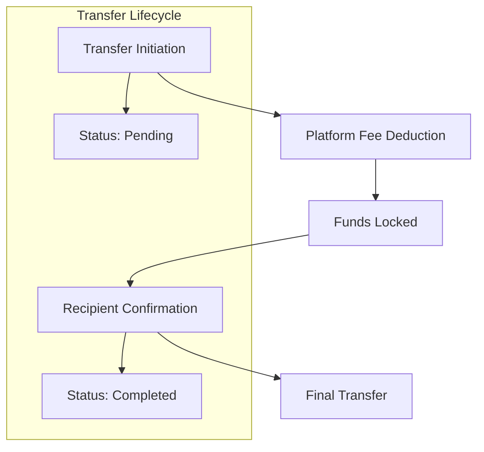

# Instant Transfer Protocol

A decentralized, secure, and efficient STX transfer platform built on the Stacks blockchain.

## Overview

Instant Transfer provides a robust, trustless mechanism for rapid STX transactions with built-in security features and minimal friction.

## Key Features

- 🚀 Fast, secure STX transfers
- 💰 Minimal platform fees (0.5%)
- 🔒 Two-step verification process
- 📋 Transfer tracking and status management
- 🛡️ Cooling period for enhanced security

## Architecture



## Transfer Workflow

1. Sender initiates transfer with recipient address and amount
2. Platform fee is automatically deducted
3. Funds are locked in contract
4. Recipient must confirm transfer after a cooling period
5. Funds released upon confirmation

## Contract Functions

### Transfer Management
- `create-transfer`: Initiate a new transfer
- `confirm-transfer`: Complete a pending transfer
- `cancel-transfer`: Cancel a pending transfer

### Administrative
- `update-platform-fee`: Adjust platform fee percentage
- `transfer-ownership`: Change contract administrator

## Getting Started

### Prerequisites
- Stacks wallet
- STX tokens for transactions

### Installation
1. Clone the repository
2. Install Clarinet
3. Deploy contract to desired network

### Example Transfer

```clarity
;; Create a transfer of 10 STX
(contract-call? .quick-transfer create-transfer 
  'STX_RECIPIENT_ADDRESS 
  u1000000 ;; 10 STX
)
```

## Security Considerations

- 0.5% platform fee
- Maximum transfer limit of 100 STX
- 24-hour cooling period
- Two-step verification
- Owner-controlled platform parameters

## Development

### Testing
```bash
clarinet test
```

### Local Deployment
```bash
clarinet console
```

## License

MIT License